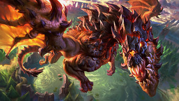

# More Dragons = More Kills? (League of Legends EDA)
Created by Devin Pham and Minh Vo

---

### Code

Importing the necessary Python libraries...
```python
import pandas as pd
import numpy as np
import os
```

```python
import plotly.express as px
pd.options.plotting.backend = 'plotly'
```

Reading in our dataset...
```python
path = os.path.join('data', '2022_LoL_esports_match_data_from_OraclesElixir.csv')
lol_2022 = pd.read_csv(path, low_memory=False)  # low_memory=False allows pandas to process null values
```

---

### Introduction



Questions to ask:

- Does the amount of dragons killed correlate to more team kills?

- Does killing the first dragon mean you are more likely to win the game?

- Do winning teams have a higher proportion of gold spent?

- Which league has the most action-packed games?


Question we plan to investigate further:

- **Does the amount of dragons kills correlate to more team kills?**

Killing a dragon in [League of Legends](https://en.wikipedia.org/wiki/League_of_Legends)grants your team small buffs in the game that would give you an edge over your opponents. By having more dragons, theoretically, your team should accumulate a higher amount of kills because of the multiple buffs that are granted Answering this question will provide professional League of Legends teams insight on one of the many factors that may influence their success in gaming tournaments.

The dataset that we will be using is the 2022 League of Legends esports match data from the website [Oracle's Elixir](https://oracleselixir.com/tools/downloads) (OE) as it is the most recent complete dataset that they have. The first 5 rows of the DataFrame and the DataFrame's dimensions are displayed below:

```python
lol_2022.head()
```

| gameid                | datacompleteness   |   url | league   |   year | split   |   playoffs | date                |   game |   patch |   participantid | side   | position   | playername   | playerid                                  | teamname                 | teamid                                  | champion   | ban1   | ban2    | ban3   | ban4   | ban5   |   gamelength |   result |   kills |   deaths |   assists |   teamkills |   teamdeaths |   doublekills |   triplekills |   quadrakills |   pentakills |   firstblood |   firstbloodkill |   firstbloodassist |   firstbloodvictim |   team kpm |   ckpm |   firstdragon |   dragons |   opp_dragons |   elementaldrakes |   opp_elementaldrakes |   infernals |   mountains |   clouds |   oceans |   chemtechs |   hextechs |   dragons (type unknown) |   elders |   opp_elders |   firstherald |   heralds |   opp_heralds |   firstbaron |   barons |   opp_barons |   firsttower |   towers |   opp_towers |   firstmidtower |   firsttothreetowers |   turretplates |   opp_turretplates |   inhibitors |   opp_inhibitors |   damagetochampions |     dpm |   damageshare |   damagetakenperminute |   damagemitigatedperminute |   wardsplaced |    wpm |   wardskilled |   wcpm |   controlwardsbought |   visionscore |   vspm |   totalgold |   earnedgold |   earned gpm |   earnedgoldshare |   goldspent |   gspd |   total cs |   minionkills |   monsterkills |   monsterkillsownjungle |   monsterkillsenemyjungle |   cspm |   goldat10 |   xpat10 |   csat10 |   opp_goldat10 |   opp_xpat10 |   opp_csat10 |   golddiffat10 |   xpdiffat10 |   csdiffat10 |   killsat10 |   assistsat10 |   deathsat10 |   opp_killsat10 |   opp_assistsat10 |   opp_deathsat10 |   goldat15 |   xpat15 |   csat15 |   opp_goldat15 |   opp_xpat15 |   opp_csat15 |   golddiffat15 |   xpdiffat15 |   csdiffat15 |   killsat15 |   assistsat15 |   deathsat15 |   opp_killsat15 |   opp_assistsat15 |   opp_deathsat15 |
|:----------------------|:-------------------|------:|:---------|-------:|:--------|-----------:|:--------------------|-------:|--------:|----------------:|:-------|:-----------|:-------------|:------------------------------------------|:-------------------------|:----------------------------------------|:-----------|:-------|:--------|:-------|:-------|:-------|-------------:|---------:|--------:|---------:|----------:|------------:|-------------:|--------------:|--------------:|--------------:|-------------:|-------------:|-----------------:|-------------------:|-------------------:|-----------:|-------:|--------------:|----------:|--------------:|------------------:|----------------------:|------------:|------------:|---------:|---------:|------------:|-----------:|-------------------------:|---------:|-------------:|--------------:|----------:|--------------:|-------------:|---------:|-------------:|-------------:|---------:|-------------:|----------------:|---------------------:|---------------:|-------------------:|-------------:|-----------------:|--------------------:|--------:|--------------:|-----------------------:|---------------------------:|--------------:|-------:|--------------:|-------:|---------------------:|--------------:|-------:|------------:|-------------:|-------------:|------------------:|------------:|-------:|-----------:|--------------:|---------------:|------------------------:|--------------------------:|-------:|-----------:|---------:|---------:|---------------:|-------------:|-------------:|---------------:|-------------:|-------------:|------------:|--------------:|-------------:|----------------:|------------------:|-----------------:|-----------:|---------:|---------:|---------------:|-------------:|-------------:|---------------:|-------------:|-------------:|------------:|--------------:|-------------:|----------------:|------------------:|-----------------:|
| ESPORTSTMNT01_2690210 | complete           |   nan | LCK CL   |   2022 | Spring  |          0 | 2022-01-10 07:44:08 |      1 |   12.01 |               1 | Blue   | top        | Soboro       | oe:player:38e0af7278d6769d0c81d7c4b47ac1e | Fredit BRION Challengers | oe:team:68911b3329146587617ab2973106e23 | Renekton   | Karma  | Caitlyn | Syndra | Thresh | Lulu   |         1713 |        0 |       2 |        3 |         2 |           9 |           19 |             0 |             0 |             0 |            0 |            0 |                0 |                  0 |                  0 |     0.3152 | 0.9807 |           nan |       nan |           nan |               nan |                   nan |         nan |         nan |      nan |      nan |         nan |        nan |                      nan |      nan |          nan |           nan |       nan |           nan |          nan |        0 |            0 |          nan |      nan |          nan |             nan |                  nan |            nan |                nan |            0 |                0 |               15768 | 552.294 |     0.278784  |               1072.4   |                    777.793 |             8 | 0.2802 |             6 | 0.2102 |                    5 |            26 | 0.9107 |       10934 |         7164 |      250.928 |          0.253859 |       10275 |    nan |        231 |           220 |             11 |                     nan |                       nan | 8.0911 |       3228 |     4909 |       89 |           3176 |         4953 |           81 |             52 |          -44 |            8 |           0 |             0 |            0 |               0 |                 0 |                0 |       5025 |     7560 |      135 |           4634 |         7215 |          121 |            391 |          345 |           14 |           0 |             1 |            0 |               0 |                 1 |                0 |
| ESPORTSTMNT01_2690210 | complete           |   nan | LCK CL   |   2022 | Spring  |          0 | 2022-01-10 07:44:08 |      1 |   12.01 |               2 | Blue   | jng        | Raptor       | oe:player:637ed20b1e41be1c51bd1a4cb211357 | Fredit BRION Challengers | oe:team:68911b3329146587617ab2973106e23 | Xin Zhao   | Karma  | Caitlyn | Syndra | Thresh | Lulu   |         1713 |        0 |       2 |        5 |         6 |           9 |           19 |             0 |             0 |             0 |            0 |            1 |                0 |                  1 |                  0 |     0.3152 | 0.9807 |           nan |       nan |           nan |               nan |                   nan |         nan |         nan |      nan |      nan |         nan |        nan |                      nan |      nan |          nan |           nan |       nan |           nan |          nan |        0 |            0 |          nan |      nan |          nan |             nan |                  nan |            nan |                nan |            0 |                1 |               11765 | 412.084 |     0.208009  |                944.273 |                    650.158 |             6 | 0.2102 |            18 | 0.6305 |                    6 |            48 | 1.6813 |        9138 |         5368 |      188.021 |          0.19022  |        8750 |    nan |        148 |            33 |            115 |                     nan |                       nan | 5.1839 |       3429 |     3484 |       58 |           2944 |         3052 |           63 |            485 |          432 |           -5 |           1 |             2 |            0 |               0 |                 0 |                1 |       5366 |     5320 |       89 |           4825 |         5595 |          100 |            541 |         -275 |          -11 |           2 |             3 |            2 |               0 |                 5 |                1 |
| ESPORTSTMNT01_2690210 | complete           |   nan | LCK CL   |   2022 | Spring  |          0 | 2022-01-10 07:44:08 |      1 |   12.01 |               3 | Blue   | mid        | Feisty       | oe:player:d1ae0e2f9f3ac1e0e0cdcb86504ca77 | Fredit BRION Challengers | oe:team:68911b3329146587617ab2973106e23 | LeBlanc    | Karma  | Caitlyn | Syndra | Thresh | Lulu   |         1713 |        0 |       2 |        2 |         3 |           9 |           19 |             0 |             0 |             0 |            0 |            0 |                0 |                  0 |                  0 |     0.3152 | 0.9807 |           nan |       nan |           nan |               nan |                   nan |         nan |         nan |      nan |      nan |         nan |        nan |                      nan |      nan |          nan |           nan |       nan |           nan |          nan |        0 |            0 |          nan |      nan |          nan |             nan |                  nan |            nan |                nan |            0 |                0 |               14258 | 499.405 |     0.252086  |                581.646 |                    227.776 |            19 | 0.6655 |             7 | 0.2452 |                    7 |            29 | 1.0158 |        9715 |         5945 |      208.231 |          0.210665 |        8725 |    nan |        193 |           177 |             16 |                     nan |                       nan | 6.7601 |       3283 |     4556 |       81 |           3121 |         4485 |           81 |            162 |           71 |            0 |           0 |             1 |            0 |               0 |                 0 |                1 |       5118 |     6942 |      120 |           5593 |         6789 |          119 |           -475 |          153 |            1 |           0 |             3 |            0 |               3 |                 3 |                2 |
| ESPORTSTMNT01_2690210 | complete           |   nan | LCK CL   |   2022 | Spring  |          0 | 2022-01-10 07:44:08 |      1 |   12.01 |               4 | Blue   | bot        | Gamin        | oe:player:998b3e49b01ecc41eacc392477a98cf | Fredit BRION Challengers | oe:team:68911b3329146587617ab2973106e23 | Samira     | Karma  | Caitlyn | Syndra | Thresh | Lulu   |         1713 |        0 |       2 |        4 |         2 |           9 |           19 |             0 |             0 |             0 |            0 |            1 |                0 |                  1 |                  0 |     0.3152 | 0.9807 |           nan |       nan |           nan |               nan |                   nan |         nan |         nan |      nan |      nan |         nan |        nan |                      nan |      nan |          nan |           nan |       nan |           nan |          nan |        0 |            0 |          nan |      nan |          nan |             nan |                  nan |            nan |                nan |            0 |                0 |               11106 | 389.002 |     0.196358  |                463.853 |                    218.879 |            12 | 0.4203 |             6 | 0.2102 |                    4 |            25 | 0.8757 |       10605 |         6835 |      239.405 |          0.242201 |       10425 |    nan |        226 |           208 |             18 |                     nan |                       nan | 7.9159 |       3600 |     3103 |       78 |           3304 |         2838 |           90 |            296 |          265 |          -12 |           1 |             1 |            0 |               0 |                 0 |                0 |       5461 |     4591 |      115 |           6254 |         5934 |          149 |           -793 |        -1343 |          -34 |           2 |             1 |            2 |               3 |                 3 |                0 |
| ESPORTSTMNT01_2690210 | complete           |   nan | LCK CL   |   2022 | Spring  |          0 | 2022-01-10 07:44:08 |      1 |   12.01 |               5 | Blue   | sup        | Loopy        | oe:player:e9741b3a238723ea6380ef2113fae63 | Fredit BRION Challengers | oe:team:68911b3329146587617ab2973106e23 | Leona      | Karma  | Caitlyn | Syndra | Thresh | Lulu   |         1713 |        0 |       1 |        5 |         6 |           9 |           19 |             0 |             0 |             0 |            0 |            1 |                1 |                  0 |                  0 |     0.3152 | 0.9807 |           nan |       nan |           nan |               nan |                   nan |         nan |         nan |      nan |      nan |         nan |        nan |                      nan |      nan |          nan |           nan |       nan |           nan |          nan |        0 |            0 |          nan |      nan |          nan |             nan |                  nan |            nan |                nan |            0 |                0 |                3663 | 128.301 |     0.0647631 |                475.026 |                    490.123 |            29 | 1.0158 |            14 | 0.4904 |                   11 |            69 | 2.4168 |        6678 |         2908 |      101.856 |          0.103054 |        6395 |    nan |         42 |            42 |              0 |                     nan |                       nan | 1.4711 |       2678 |     2161 |       16 |           2150 |         2748 |           15 |            528 |         -587 |            1 |           1 |             1 |            0 |               0 |                 0 |                1 |       3836 |     3588 |       28 |           3393 |         4085 |           21 |            443 |         -497 |            7 |           1 |             2 |            2 |               0 |                 6 |                2 |

```python
lol_2022.shape  # (rows, columns)
```
(149232, 123)

The original dataset contains 149232 rows and 123 columns. We will be using 3 columns. Using OE's [definitions page](https://oracleselixir.com/tools/downloads) along with our background on the game, we defined these columns below:

| Column           | Type   | Description                    |
|:-----------------|:-------|:-------------------------------|
| gameid           | object | Unique identifier to each game |
| datacompleteness | object | Whether the data is complete   |
| url              | object | Webpage address to game        |

---

### Cleaning and EDA
#### Data Cleaning
Since many of these columns should be of type `bool`, but they are not, we will convert these columns to their appropriate type.

```python
for col in lol_2022.columns:
    if ((lol_2022[col] == 0) | (lol_2022[col] == 1)).sum() == lol_2022.shape[0]:
        lol_2022[col] = lol_2022[col].astype(bool)

lol_2022.head()
```

| gameid                | datacompleteness   |   url | league   |   year | split   | playoffs   | date                |   game |   patch |   participantid | side   | position   | playername   | playerid                                  | teamname                 | teamid                                  | champion   | ban1   | ban2    | ban3   | ban4   | ban5   |   gamelength | result   |   kills |   deaths |   assists |   teamkills |   teamdeaths |   doublekills |   triplekills |   quadrakills |   pentakills |   firstblood |   firstbloodkill |   firstbloodassist |   firstbloodvictim |   team kpm |   ckpm |   firstdragon |   dragons |   opp_dragons |   elementaldrakes |   opp_elementaldrakes |   infernals |   mountains |   clouds |   oceans |   chemtechs |   hextechs |   dragons (type unknown) |   elders |   opp_elders |   firstherald |   heralds |   opp_heralds |   firstbaron |   barons |   opp_barons |   firsttower |   towers |   opp_towers |   firstmidtower |   firsttothreetowers |   turretplates |   opp_turretplates |   inhibitors |   opp_inhibitors |   damagetochampions |     dpm |   damageshare |   damagetakenperminute |   damagemitigatedperminute |   wardsplaced |    wpm |   wardskilled |   wcpm |   controlwardsbought |   visionscore |   vspm |   totalgold |   earnedgold |   earned gpm |   earnedgoldshare |   goldspent |   gspd |   total cs |   minionkills |   monsterkills |   monsterkillsownjungle |   monsterkillsenemyjungle |   cspm |   goldat10 |   xpat10 |   csat10 |   opp_goldat10 |   opp_xpat10 |   opp_csat10 |   golddiffat10 |   xpdiffat10 |   csdiffat10 |   killsat10 |   assistsat10 |   deathsat10 |   opp_killsat10 |   opp_assistsat10 |   opp_deathsat10 |   goldat15 |   xpat15 |   csat15 |   opp_goldat15 |   opp_xpat15 |   opp_csat15 |   golddiffat15 |   xpdiffat15 |   csdiffat15 |   killsat15 |   assistsat15 |   deathsat15 |   opp_killsat15 |   opp_assistsat15 |   opp_deathsat15 |
|:----------------------|:-------------------|------:|:---------|-------:|:--------|:-----------|:--------------------|-------:|--------:|----------------:|:-------|:-----------|:-------------|:------------------------------------------|:-------------------------|:----------------------------------------|:-----------|:-------|:--------|:-------|:-------|:-------|-------------:|:---------|--------:|---------:|----------:|------------:|-------------:|--------------:|--------------:|--------------:|-------------:|-------------:|-----------------:|-------------------:|-------------------:|-----------:|-------:|--------------:|----------:|--------------:|------------------:|----------------------:|------------:|------------:|---------:|---------:|------------:|-----------:|-------------------------:|---------:|-------------:|--------------:|----------:|--------------:|-------------:|---------:|-------------:|-------------:|---------:|-------------:|----------------:|---------------------:|---------------:|-------------------:|-------------:|-----------------:|--------------------:|--------:|--------------:|-----------------------:|---------------------------:|--------------:|-------:|--------------:|-------:|---------------------:|--------------:|-------:|------------:|-------------:|-------------:|------------------:|------------:|-------:|-----------:|--------------:|---------------:|------------------------:|--------------------------:|-------:|-----------:|---------:|---------:|---------------:|-------------:|-------------:|---------------:|-------------:|-------------:|------------:|--------------:|-------------:|----------------:|------------------:|-----------------:|-----------:|---------:|---------:|---------------:|-------------:|-------------:|---------------:|-------------:|-------------:|------------:|--------------:|-------------:|----------------:|------------------:|-----------------:|
| ESPORTSTMNT01_2690210 | complete           |   nan | LCK CL   |   2022 | Spring  | False      | 2022-01-10 07:44:08 |      1 |   12.01 |               1 | Blue   | top        | Soboro       | oe:player:38e0af7278d6769d0c81d7c4b47ac1e | Fredit BRION Challengers | oe:team:68911b3329146587617ab2973106e23 | Renekton   | Karma  | Caitlyn | Syndra | Thresh | Lulu   |         1713 | False    |       2 |        3 |         2 |           9 |           19 |             0 |             0 |             0 |            0 |            0 |                0 |                  0 |                  0 |     0.3152 | 0.9807 |           nan |       nan |           nan |               nan |                   nan |         nan |         nan |      nan |      nan |         nan |        nan |                      nan |      nan |          nan |           nan |       nan |           nan |          nan |        0 |            0 |          nan |      nan |          nan |             nan |                  nan |            nan |                nan |            0 |                0 |               15768 | 552.294 |     0.278784  |               1072.4   |                    777.793 |             8 | 0.2802 |             6 | 0.2102 |                    5 |            26 | 0.9107 |       10934 |         7164 |      250.928 |          0.253859 |       10275 |    nan |        231 |           220 |             11 |                     nan |                       nan | 8.0911 |       3228 |     4909 |       89 |           3176 |         4953 |           81 |             52 |          -44 |            8 |           0 |             0 |            0 |               0 |                 0 |                0 |       5025 |     7560 |      135 |           4634 |         7215 |          121 |            391 |          345 |           14 |           0 |             1 |            0 |               0 |                 1 |                0 |
| ESPORTSTMNT01_2690210 | complete           |   nan | LCK CL   |   2022 | Spring  | False      | 2022-01-10 07:44:08 |      1 |   12.01 |               2 | Blue   | jng        | Raptor       | oe:player:637ed20b1e41be1c51bd1a4cb211357 | Fredit BRION Challengers | oe:team:68911b3329146587617ab2973106e23 | Xin Zhao   | Karma  | Caitlyn | Syndra | Thresh | Lulu   |         1713 | False    |       2 |        5 |         6 |           9 |           19 |             0 |             0 |             0 |            0 |            1 |                0 |                  1 |                  0 |     0.3152 | 0.9807 |           nan |       nan |           nan |               nan |                   nan |         nan |         nan |      nan |      nan |         nan |        nan |                      nan |      nan |          nan |           nan |       nan |           nan |          nan |        0 |            0 |          nan |      nan |          nan |             nan |                  nan |            nan |                nan |            0 |                1 |               11765 | 412.084 |     0.208009  |                944.273 |                    650.158 |             6 | 0.2102 |            18 | 0.6305 |                    6 |            48 | 1.6813 |        9138 |         5368 |      188.021 |          0.19022  |        8750 |    nan |        148 |            33 |            115 |                     nan |                       nan | 5.1839 |       3429 |     3484 |       58 |           2944 |         3052 |           63 |            485 |          432 |           -5 |           1 |             2 |            0 |               0 |                 0 |                1 |       5366 |     5320 |       89 |           4825 |         5595 |          100 |            541 |         -275 |          -11 |           2 |             3 |            2 |               0 |                 5 |                1 |
| ESPORTSTMNT01_2690210 | complete           |   nan | LCK CL   |   2022 | Spring  | False      | 2022-01-10 07:44:08 |      1 |   12.01 |               3 | Blue   | mid        | Feisty       | oe:player:d1ae0e2f9f3ac1e0e0cdcb86504ca77 | Fredit BRION Challengers | oe:team:68911b3329146587617ab2973106e23 | LeBlanc    | Karma  | Caitlyn | Syndra | Thresh | Lulu   |         1713 | False    |       2 |        2 |         3 |           9 |           19 |             0 |             0 |             0 |            0 |            0 |                0 |                  0 |                  0 |     0.3152 | 0.9807 |           nan |       nan |           nan |               nan |                   nan |         nan |         nan |      nan |      nan |         nan |        nan |                      nan |      nan |          nan |           nan |       nan |           nan |          nan |        0 |            0 |          nan |      nan |          nan |             nan |                  nan |            nan |                nan |            0 |                0 |               14258 | 499.405 |     0.252086  |                581.646 |                    227.776 |            19 | 0.6655 |             7 | 0.2452 |                    7 |            29 | 1.0158 |        9715 |         5945 |      208.231 |          0.210665 |        8725 |    nan |        193 |           177 |             16 |                     nan |                       nan | 6.7601 |       3283 |     4556 |       81 |           3121 |         4485 |           81 |            162 |           71 |            0 |           0 |             1 |            0 |               0 |                 0 |                1 |       5118 |     6942 |      120 |           5593 |         6789 |          119 |           -475 |          153 |            1 |           0 |             3 |            0 |               3 |                 3 |                2 |
| ESPORTSTMNT01_2690210 | complete           |   nan | LCK CL   |   2022 | Spring  | False      | 2022-01-10 07:44:08 |      1 |   12.01 |               4 | Blue   | bot        | Gamin        | oe:player:998b3e49b01ecc41eacc392477a98cf | Fredit BRION Challengers | oe:team:68911b3329146587617ab2973106e23 | Samira     | Karma  | Caitlyn | Syndra | Thresh | Lulu   |         1713 | False    |       2 |        4 |         2 |           9 |           19 |             0 |             0 |             0 |            0 |            1 |                0 |                  1 |                  0 |     0.3152 | 0.9807 |           nan |       nan |           nan |               nan |                   nan |         nan |         nan |      nan |      nan |         nan |        nan |                      nan |      nan |          nan |           nan |       nan |           nan |          nan |        0 |            0 |          nan |      nan |          nan |             nan |                  nan |            nan |                nan |            0 |                0 |               11106 | 389.002 |     0.196358  |                463.853 |                    218.879 |            12 | 0.4203 |             6 | 0.2102 |                    4 |            25 | 0.8757 |       10605 |         6835 |      239.405 |          0.242201 |       10425 |    nan |        226 |           208 |             18 |                     nan |                       nan | 7.9159 |       3600 |     3103 |       78 |           3304 |         2838 |           90 |            296 |          265 |          -12 |           1 |             1 |            0 |               0 |                 0 |                0 |       5461 |     4591 |      115 |           6254 |         5934 |          149 |           -793 |        -1343 |          -34 |           2 |             1 |            2 |               3 |                 3 |                0 |
| ESPORTSTMNT01_2690210 | complete           |   nan | LCK CL   |   2022 | Spring  | False      | 2022-01-10 07:44:08 |      1 |   12.01 |               5 | Blue   | sup        | Loopy        | oe:player:e9741b3a238723ea6380ef2113fae63 | Fredit BRION Challengers | oe:team:68911b3329146587617ab2973106e23 | Leona      | Karma  | Caitlyn | Syndra | Thresh | Lulu   |         1713 | False    |       1 |        5 |         6 |           9 |           19 |             0 |             0 |             0 |            0 |            1 |                1 |                  0 |                  0 |     0.3152 | 0.9807 |           nan |       nan |           nan |               nan |                   nan |         nan |         nan |      nan |      nan |         nan |        nan |                      nan |      nan |          nan |           nan |       nan |           nan |          nan |        0 |            0 |          nan |      nan |          nan |             nan |                  nan |            nan |                nan |            0 |                0 |                3663 | 128.301 |     0.0647631 |                475.026 |                    490.123 |            29 | 1.0158 |            14 | 0.4904 |                   11 |            69 | 2.4168 |        6678 |         2908 |      101.856 |          0.103054 |        6395 |    nan |         42 |            42 |              0 |                     nan |                       nan | 1.4711 |       2678 |     2161 |       16 |           2150 |         2748 |           15 |            528 |         -587 |            1 |           1 |             1 |            0 |               0 |                 0 |                1 |       3836 |     3588 |       28 |           3393 |         4085 |           21 |            443 |         -497 |            7 |           1 |             2 |            2 |               0 |                 6 |                2 |

We were told that during the data generating process (DGP), game, player, and team data were combined together in that each `gameid` corresponds to up to 12 rows (5 rows for players in one team, 5 rows for players in the opposing team, and 2 rows containing summary data for the two teams). We can separate each dataset into three DataFrames to distinguish each type of data. The first five columns of each DataFrame are displayed below:

***Note:*** In each of the following DataFrames, we also dropped all of the columns that have all missing values since these values are missing by design (MD).

```python
games = lol_2022[lol_2022['gameid'].str.contains('game')]
games = (
    games
    .drop(columns=games.columns[games.isna().all()])
    .set_index('gameid')
)
games.head()
```

| gameid           | datacompleteness   | url                                         | league   |   year | split   | playoffs   | date                |   game |   patch |   participantid | side   | position   | playername   | playerid                                  | teamname   | teamid                                  | champion   | ban1     | ban2    | ban3    | ban4   | ban5    |   gamelength | result   |   kills |   deaths |   assists |   teamkills |   teamdeaths |   firstblood |   firstbloodkill |   team kpm |   ckpm |   dragons |   opp_dragons |   dragons (type unknown) |   barons |   opp_barons |   towers |   opp_towers |   inhibitors |   opp_inhibitors |   damagetochampions |     dpm |   damageshare |   damagetakenperminute |   wardsplaced |    wpm |   wardskilled |   wcpm |   controlwardsbought |   visionscore |   vspm |   totalgold |   earnedgold |   earned gpm |   earnedgoldshare |   goldspent |   gspd |   total cs |   minionkills |   monsterkills |   monsterkillsownjungle |   monsterkillsenemyjungle |   cspm |
|:-----------------|:-------------------|:--------------------------------------------|:---------|-------:|:--------|:-----------|:--------------------|-------:|--------:|----------------:|:-------|:-----------|:-------------|:------------------------------------------|:-----------|:----------------------------------------|:-----------|:---------|:--------|:--------|:-------|:--------|-------------:|:---------|--------:|---------:|----------:|------------:|-------------:|-------------:|-----------------:|-----------:|-------:|----------:|--------------:|-------------------------:|---------:|-------------:|---------:|-------------:|-------------:|-----------------:|--------------------:|--------:|--------------:|-----------------------:|--------------:|-------:|--------------:|-------:|---------------------:|--------------:|-------:|------------:|-------------:|-------------:|------------------:|------------:|-------:|-----------:|--------------:|---------------:|------------------------:|--------------------------:|-------:|
| 8401-8401_game_1 | partial            | https://lpl.qq.com/es/stats.shtml?bmid=8401 | LPL      |   2022 | Spring  | False      | 2022-01-10 09:24:26 |      1 |   12.01 |               1 | Blue   | top        | shanji       | oe:player:708bbc09836488d812e6775a07d785f | Oh My God  | oe:team:f4c4528c6981e104a11ea7548630c23 | Gwen       | Renekton | Lee Sin | Caitlyn | Jayce  | Camille |         1365 | True     |       5 |        0 |         4 |          13 |            6 |          nan |                0 |     0.5714 | 0.8352 |       nan |           nan |                      nan |      nan |          nan |      nan |          nan |          nan |              nan |               11188 | 491.78  |     0.279107  |                585.802 |             7 | 0.3077 |             5 | 0.2198 |                    3 |            23 | 1.011  |        9123 |         6063 |      266.505 |          0.200975 |        7365 |    nan |        172 |           160 |             12 |                       6 |                         6 | 7.5604 |
| 8401-8401_game_1 | partial            | https://lpl.qq.com/es/stats.shtml?bmid=8401 | LPL      |   2022 | Spring  | False      | 2022-01-10 09:24:26 |      1 |   12.01 |               2 | Blue   | jng        | Aki          | oe:player:3faae62fb907ad7cbcf2167beb8b2c7 | Oh My God  | oe:team:f4c4528c6981e104a11ea7548630c23 | Jarvan IV  | Renekton | Lee Sin | Caitlyn | Jayce  | Camille |         1365 | True     |       0 |        1 |        13 |          13 |            6 |          nan |                0 |     0.5714 | 0.8352 |       nan |           nan |                      nan |      nan |          nan |      nan |          nan |          nan |              nan |                4426 | 194.549 |     0.110416  |                828.835 |             7 | 0.3077 |            10 | 0.4396 |                    5 |            39 | 1.7143 |        9041 |         5981 |      262.901 |          0.198256 |        6515 |    nan |        145 |            13 |            132 |                      71 |                        12 | 6.3736 |
| 8401-8401_game_1 | partial            | https://lpl.qq.com/es/stats.shtml?bmid=8401 | LPL      |   2022 | Spring  | False      | 2022-01-10 09:24:26 |      1 |   12.01 |               3 | Blue   | mid        | Creme        | oe:player:6e7908512cb309a43388bb464a312a2 | Oh My God  | oe:team:f4c4528c6981e104a11ea7548630c23 | Syndra     | Renekton | Lee Sin | Caitlyn | Jayce  | Camille |         1365 | True     |       3 |        0 |         5 |          13 |            6 |          nan |                0 |     0.5714 | 0.8352 |       nan |           nan |                      nan |      nan |          nan |      nan |          nan |          nan |              nan |               12577 | 552.835 |     0.313755  |                201.89  |             8 | 0.3516 |             2 | 0.0879 |                    4 |            18 | 0.7912 |        9928 |         6868 |      301.89  |          0.227659 |        8129 |    nan |        212 |           204 |              8 |                       8 |                         0 | 9.3187 |
| 8401-8401_game_1 | partial            | https://lpl.qq.com/es/stats.shtml?bmid=8401 | LPL      |   2022 | Spring  | False      | 2022-01-10 09:24:26 |      1 |   12.01 |               4 | Blue   | bot        | Able         | oe:player:3205348b11b8cf2b6663318b143928f | Oh My God  | oe:team:f4c4528c6981e104a11ea7548630c23 | Jinx       | Renekton | Lee Sin | Caitlyn | Jayce  | Camille |         1365 | True     |       4 |        1 |         6 |          13 |            6 |          nan |                0 |     0.5714 | 0.8352 |       nan |           nan |                      nan |      nan |          nan |      nan |          nan |          nan |              nan |                9618 | 422.769 |     0.239943  |                254.813 |            23 | 1.011  |            12 | 0.5275 |                    7 |            44 | 1.9341 |       10778 |         7718 |      339.253 |          0.255836 |        9274 |    nan |        199 |           179 |             20 |                      14 |                         0 | 8.7473 |
| 8401-8401_game_1 | partial            | https://lpl.qq.com/es/stats.shtml?bmid=8401 | LPL      |   2022 | Spring  | False      | 2022-01-10 09:24:26 |      1 |   12.01 |               5 | Blue   | sup        | COLD         | oe:player:3f7ff4daa99912d1b0c8c64340edb9f | Oh My God  | oe:team:f4c4528c6981e104a11ea7548630c23 | Nautilus   | Renekton | Lee Sin | Caitlyn | Jayce  | Camille |         1365 | True     |       1 |        4 |         7 |          13 |            6 |          nan |                0 |     0.5714 | 0.8352 |       nan |           nan |                      nan |      nan |          nan |      nan |          nan |          nan |              nan |                2276 | 100.044 |     0.0567798 |                391.912 |            34 | 1.4945 |             4 | 0.1758 |                   13 |            38 | 1.6703 |        6598 |         3538 |      155.517 |          0.117274 |        5625 |    nan |         22 |            22 |              0 |                       0 |                         0 | 0.967  |

```python
players = lol_2022[~lol_2022['gameid'].str.contains('game')]
players = (
    players
    .drop(columns=players.columns[players.isna().all()])
    .set_index('gameid')
)
players.head()
```

| gameid                | datacompleteness   |   url | league   |   year | split   | playoffs   | date                |   game |   patch |   participantid | side   | position   | playername   | playerid                                  | teamname                 | teamid                                  | champion   | ban1   | ban2    | ban3   | ban4   | ban5   |   gamelength | result   |   kills |   deaths |   assists |   teamkills |   teamdeaths |   doublekills |   triplekills |   quadrakills |   pentakills |   firstblood |   firstbloodkill |   firstbloodassist |   firstbloodvictim |   team kpm |   ckpm |   firstdragon |   dragons |   opp_dragons |   elementaldrakes |   opp_elementaldrakes |   infernals |   mountains |   clouds |   oceans |   chemtechs |   hextechs |   dragons (type unknown) |   elders |   opp_elders |   firstherald |   heralds |   opp_heralds |   firstbaron |   barons |   opp_barons |   firsttower |   towers |   opp_towers |   firstmidtower |   firsttothreetowers |   turretplates |   opp_turretplates |   inhibitors |   opp_inhibitors |   damagetochampions |     dpm |   damageshare |   damagetakenperminute |   damagemitigatedperminute |   wardsplaced |    wpm |   wardskilled |   wcpm |   controlwardsbought |   visionscore |   vspm |   totalgold |   earnedgold |   earned gpm |   earnedgoldshare |   goldspent |   gspd |   total cs |   minionkills |   monsterkills |   monsterkillsownjungle |   monsterkillsenemyjungle |   cspm |   goldat10 |   xpat10 |   csat10 |   opp_goldat10 |   opp_xpat10 |   opp_csat10 |   golddiffat10 |   xpdiffat10 |   csdiffat10 |   killsat10 |   assistsat10 |   deathsat10 |   opp_killsat10 |   opp_assistsat10 |   opp_deathsat10 |   goldat15 |   xpat15 |   csat15 |   opp_goldat15 |   opp_xpat15 |   opp_csat15 |   golddiffat15 |   xpdiffat15 |   csdiffat15 |   killsat15 |   assistsat15 |   deathsat15 |   opp_killsat15 |   opp_assistsat15 |   opp_deathsat15 |
|:----------------------|:-------------------|------:|:---------|-------:|:--------|:-----------|:--------------------|-------:|--------:|----------------:|:-------|:-----------|:-------------|:------------------------------------------|:-------------------------|:----------------------------------------|:-----------|:-------|:--------|:-------|:-------|:-------|-------------:|:---------|--------:|---------:|----------:|------------:|-------------:|--------------:|--------------:|--------------:|-------------:|-------------:|-----------------:|-------------------:|-------------------:|-----------:|-------:|--------------:|----------:|--------------:|------------------:|----------------------:|------------:|------------:|---------:|---------:|------------:|-----------:|-------------------------:|---------:|-------------:|--------------:|----------:|--------------:|-------------:|---------:|-------------:|-------------:|---------:|-------------:|----------------:|---------------------:|---------------:|-------------------:|-------------:|-----------------:|--------------------:|--------:|--------------:|-----------------------:|---------------------------:|--------------:|-------:|--------------:|-------:|---------------------:|--------------:|-------:|------------:|-------------:|-------------:|------------------:|------------:|-------:|-----------:|--------------:|---------------:|------------------------:|--------------------------:|-------:|-----------:|---------:|---------:|---------------:|-------------:|-------------:|---------------:|-------------:|-------------:|------------:|--------------:|-------------:|----------------:|------------------:|-----------------:|-----------:|---------:|---------:|---------------:|-------------:|-------------:|---------------:|-------------:|-------------:|------------:|--------------:|-------------:|----------------:|------------------:|-----------------:|
| ESPORTSTMNT01_2690210 | complete           |   nan | LCK CL   |   2022 | Spring  | False      | 2022-01-10 07:44:08 |      1 |   12.01 |               1 | Blue   | top        | Soboro       | oe:player:38e0af7278d6769d0c81d7c4b47ac1e | Fredit BRION Challengers | oe:team:68911b3329146587617ab2973106e23 | Renekton   | Karma  | Caitlyn | Syndra | Thresh | Lulu   |         1713 | False    |       2 |        3 |         2 |           9 |           19 |             0 |             0 |             0 |            0 |            0 |                0 |                  0 |                  0 |     0.3152 | 0.9807 |           nan |       nan |           nan |               nan |                   nan |         nan |         nan |      nan |      nan |         nan |        nan |                      nan |      nan |          nan |           nan |       nan |           nan |          nan |        0 |            0 |          nan |      nan |          nan |             nan |                  nan |            nan |                nan |            0 |                0 |               15768 | 552.294 |     0.278784  |               1072.4   |                    777.793 |             8 | 0.2802 |             6 | 0.2102 |                    5 |            26 | 0.9107 |       10934 |         7164 |      250.928 |          0.253859 |       10275 |    nan |        231 |           220 |             11 |                     nan |                       nan | 8.0911 |       3228 |     4909 |       89 |           3176 |         4953 |           81 |             52 |          -44 |            8 |           0 |             0 |            0 |               0 |                 0 |                0 |       5025 |     7560 |      135 |           4634 |         7215 |          121 |            391 |          345 |           14 |           0 |             1 |            0 |               0 |                 1 |                0 |
| ESPORTSTMNT01_2690210 | complete           |   nan | LCK CL   |   2022 | Spring  | False      | 2022-01-10 07:44:08 |      1 |   12.01 |               2 | Blue   | jng        | Raptor       | oe:player:637ed20b1e41be1c51bd1a4cb211357 | Fredit BRION Challengers | oe:team:68911b3329146587617ab2973106e23 | Xin Zhao   | Karma  | Caitlyn | Syndra | Thresh | Lulu   |         1713 | False    |       2 |        5 |         6 |           9 |           19 |             0 |             0 |             0 |            0 |            1 |                0 |                  1 |                  0 |     0.3152 | 0.9807 |           nan |       nan |           nan |               nan |                   nan |         nan |         nan |      nan |      nan |         nan |        nan |                      nan |      nan |          nan |           nan |       nan |           nan |          nan |        0 |            0 |          nan |      nan |          nan |             nan |                  nan |            nan |                nan |            0 |                1 |               11765 | 412.084 |     0.208009  |                944.273 |                    650.158 |             6 | 0.2102 |            18 | 0.6305 |                    6 |            48 | 1.6813 |        9138 |         5368 |      188.021 |          0.19022  |        8750 |    nan |        148 |            33 |            115 |                     nan |                       nan | 5.1839 |       3429 |     3484 |       58 |           2944 |         3052 |           63 |            485 |          432 |           -5 |           1 |             2 |            0 |               0 |                 0 |                1 |       5366 |     5320 |       89 |           4825 |         5595 |          100 |            541 |         -275 |          -11 |           2 |             3 |            2 |               0 |                 5 |                1 |
| ESPORTSTMNT01_2690210 | complete           |   nan | LCK CL   |   2022 | Spring  | False      | 2022-01-10 07:44:08 |      1 |   12.01 |               3 | Blue   | mid        | Feisty       | oe:player:d1ae0e2f9f3ac1e0e0cdcb86504ca77 | Fredit BRION Challengers | oe:team:68911b3329146587617ab2973106e23 | LeBlanc    | Karma  | Caitlyn | Syndra | Thresh | Lulu   |         1713 | False    |       2 |        2 |         3 |           9 |           19 |             0 |             0 |             0 |            0 |            0 |                0 |                  0 |                  0 |     0.3152 | 0.9807 |           nan |       nan |           nan |               nan |                   nan |         nan |         nan |      nan |      nan |         nan |        nan |                      nan |      nan |          nan |           nan |       nan |           nan |          nan |        0 |            0 |          nan |      nan |          nan |             nan |                  nan |            nan |                nan |            0 |                0 |               14258 | 499.405 |     0.252086  |                581.646 |                    227.776 |            19 | 0.6655 |             7 | 0.2452 |                    7 |            29 | 1.0158 |        9715 |         5945 |      208.231 |          0.210665 |        8725 |    nan |        193 |           177 |             16 |                     nan |                       nan | 6.7601 |       3283 |     4556 |       81 |           3121 |         4485 |           81 |            162 |           71 |            0 |           0 |             1 |            0 |               0 |                 0 |                1 |       5118 |     6942 |      120 |           5593 |         6789 |          119 |           -475 |          153 |            1 |           0 |             3 |            0 |               3 |                 3 |                2 |
| ESPORTSTMNT01_2690210 | complete           |   nan | LCK CL   |   2022 | Spring  | False      | 2022-01-10 07:44:08 |      1 |   12.01 |               4 | Blue   | bot        | Gamin        | oe:player:998b3e49b01ecc41eacc392477a98cf | Fredit BRION Challengers | oe:team:68911b3329146587617ab2973106e23 | Samira     | Karma  | Caitlyn | Syndra | Thresh | Lulu   |         1713 | False    |       2 |        4 |         2 |           9 |           19 |             0 |             0 |             0 |            0 |            1 |                0 |                  1 |                  0 |     0.3152 | 0.9807 |           nan |       nan |           nan |               nan |                   nan |         nan |         nan |      nan |      nan |         nan |        nan |                      nan |      nan |          nan |           nan |       nan |           nan |          nan |        0 |            0 |          nan |      nan |          nan |             nan |                  nan |            nan |                nan |            0 |                0 |               11106 | 389.002 |     0.196358  |                463.853 |                    218.879 |            12 | 0.4203 |             6 | 0.2102 |                    4 |            25 | 0.8757 |       10605 |         6835 |      239.405 |          0.242201 |       10425 |    nan |        226 |           208 |             18 |                     nan |                       nan | 7.9159 |       3600 |     3103 |       78 |           3304 |         2838 |           90 |            296 |          265 |          -12 |           1 |             1 |            0 |               0 |                 0 |                0 |       5461 |     4591 |      115 |           6254 |         5934 |          149 |           -793 |        -1343 |          -34 |           2 |             1 |            2 |               3 |                 3 |                0 |
| ESPORTSTMNT01_2690210 | complete           |   nan | LCK CL   |   2022 | Spring  | False      | 2022-01-10 07:44:08 |      1 |   12.01 |               5 | Blue   | sup        | Loopy        | oe:player:e9741b3a238723ea6380ef2113fae63 | Fredit BRION Challengers | oe:team:68911b3329146587617ab2973106e23 | Leona      | Karma  | Caitlyn | Syndra | Thresh | Lulu   |         1713 | False    |       1 |        5 |         6 |           9 |           19 |             0 |             0 |             0 |            0 |            1 |                1 |                  0 |                  0 |     0.3152 | 0.9807 |           nan |       nan |           nan |               nan |                   nan |         nan |         nan |      nan |      nan |         nan |        nan |                      nan |      nan |          nan |           nan |       nan |           nan |          nan |        0 |            0 |          nan |      nan |          nan |             nan |                  nan |            nan |                nan |            0 |                0 |                3663 | 128.301 |     0.0647631 |                475.026 |                    490.123 |            29 | 1.0158 |            14 | 0.4904 |                   11 |            69 | 2.4168 |        6678 |         2908 |      101.856 |          0.103054 |        6395 |    nan |         42 |            42 |              0 |                     nan |                       nan | 1.4711 |       2678 |     2161 |       16 |           2150 |         2748 |           15 |            528 |         -587 |            1 |           1 |             1 |            0 |               0 |                 0 |                1 |       3836 |     3588 |       28 |           3393 |         4085 |           21 |            443 |         -497 |            7 |           1 |             2 |            2 |               0 |                 6 |                2 |

```
teams = (
    players
    .reset_index()
    .groupby('gameid').apply(lambda df: df.iloc[-2:])
)
teams = teams.drop(columns=list(teams.columns[teams.isna().all()]) + ['gameid'])
teams.head()
```

|                               | datacompleteness   |   url | league   |   year | split   | playoffs   | date                |   game |   patch |   participantid | side   | position   | teamname                      | teamid                                  | ban1    | ban2         | ban3         | ban4     | ban5    |   gamelength | result   |   kills |   deaths |   assists |   teamkills |   teamdeaths |   doublekills |   triplekills |   quadrakills |   pentakills |   firstblood |   team kpm |   ckpm |   firstdragon |   dragons |   opp_dragons |   elementaldrakes |   opp_elementaldrakes |   infernals |   mountains |   clouds |   oceans |   chemtechs |   hextechs |   dragons (type unknown) |   elders |   opp_elders |   firstherald |   heralds |   opp_heralds |   firstbaron |   barons |   opp_barons |   firsttower |   towers |   opp_towers |   firstmidtower |   firsttothreetowers |   turretplates |   opp_turretplates |   inhibitors |   opp_inhibitors |   damagetochampions |     dpm |   damagetakenperminute |   damagemitigatedperminute |   wardsplaced |    wpm |   wardskilled |   wcpm |   controlwardsbought |   visionscore |   vspm |   totalgold |   earnedgold |   earned gpm |   goldspent |       gspd |   minionkills |   monsterkills |   monsterkillsownjungle |   monsterkillsenemyjungle |    cspm |   goldat10 |   xpat10 |   csat10 |   opp_goldat10 |   opp_xpat10 |   opp_csat10 |   golddiffat10 |   xpdiffat10 |   csdiffat10 |   killsat10 |   assistsat10 |   deathsat10 |   opp_killsat10 |   opp_assistsat10 |   opp_deathsat10 |   goldat15 |   xpat15 |   csat15 |   opp_goldat15 |   opp_xpat15 |   opp_csat15 |   golddiffat15 |   xpdiffat15 |   csdiffat15 |   killsat15 |   assistsat15 |   deathsat15 |   opp_killsat15 |   opp_assistsat15 |   opp_deathsat15 |
|:------------------------------|:-------------------|------:|:---------|-------:|:--------|:-----------|:--------------------|-------:|--------:|----------------:|:-------|:-----------|:------------------------------|:----------------------------------------|:--------|:-------------|:-------------|:---------|:--------|-------------:|:---------|--------:|---------:|----------:|------------:|-------------:|--------------:|--------------:|--------------:|-------------:|-------------:|-----------:|-------:|--------------:|----------:|--------------:|------------------:|----------------------:|------------:|------------:|---------:|---------:|------------:|-----------:|-------------------------:|---------:|-------------:|--------------:|----------:|--------------:|-------------:|---------:|-------------:|-------------:|---------:|-------------:|----------------:|---------------------:|---------------:|-------------------:|-------------:|-----------------:|--------------------:|--------:|-----------------------:|---------------------------:|--------------:|-------:|--------------:|-------:|---------------------:|--------------:|-------:|------------:|-------------:|-------------:|------------:|-----------:|--------------:|---------------:|------------------------:|--------------------------:|--------:|-----------:|---------:|---------:|---------------:|-------------:|-------------:|---------------:|-------------:|-------------:|------------:|--------------:|-------------:|----------------:|------------------:|-----------------:|-----------:|---------:|---------:|---------------:|-------------:|-------------:|---------------:|-------------:|-------------:|------------:|--------------:|-------------:|----------------:|------------------:|-----------------:|
| ('ESPORTSTMNT01_2690210', 10) | complete           |   nan | LCK CL   |   2022 | Spring  | False      | 2022-01-10 07:44:08 |      1 |   12.01 |             100 | Blue   | team       | Fredit BRION Challengers      | oe:team:68911b3329146587617ab2973106e23 | Karma   | Caitlyn      | Syndra       | Thresh   | Lulu    |         1713 | False    |       9 |       19 |        19 |           9 |           19 |             0 |             0 |             0 |            0 |            1 |     0.3152 | 0.9807 |             0 |         1 |             3 |                 1 |                     3 |           0 |           0 |        0 |        0 |           0 |          1 |                      nan |        0 |            0 |             1 |         2 |             0 |            0 |        0 |            0 |            1 |        3 |            6 |               1 |                    1 |              5 |                  0 |            0 |                1 |               56560 | 1981.09 |                3537.2  |                    2364.73 |            74 | 2.5919 |            51 | 1.7863 |                   33 |           197 | 6.9002 |       47070 |        28222 |      988.511 |       44570 | -0.0283123 |           680 |            160 |                     nan |                       nan | 29.4221 |      16218 |    18213 |      322 |          14695 |        18076 |          330 |           1523 |          137 |           -8 |           3 |             5 |            0 |               0 |                 0 |                3 |      24806 |    28001 |      487 |          24699 |        29618 |          510 |            107 |        -1617 |          -23 |           5 |            10 |            6 |               6 |                18 |                5 |
| ('ESPORTSTMNT01_2690210', 11) | complete           |   nan | LCK CL   |   2022 | Spring  | False      | 2022-01-10 07:44:08 |      1 |   12.01 |             200 | Red    | team       | Nongshim RedForce Challengers | oe:team:d2dc3681437e2beb2bb4742477108ff | Lee Sin | Twisted Fate | Zoe          | Nautilus | Rell    |         1713 | True     |      19 |        9 |        62 |          19 |            9 |             6 |             0 |             0 |            0 |            0 |     0.6655 | 0.9807 |             1 |         3 |             1 |                 3 |                     1 |           2 |           1 |        0 |        0 |           0 |          0 |                      nan |        0 |            0 |             0 |         0 |             2 |            0 |        0 |            0 |            0 |        6 |            3 |               0 |                    0 |              0 |                  5 |            1 |                0 |               79912 | 2799.02 |                3009.67 |                    2872.33 |            93 | 3.2574 |            51 | 1.7863 |                   45 |           205 | 7.1804 |       52617 |        33769 |     1182.8   |       45850 |  0.0283123 |           792 |            184 |                     nan |                       nan | 34.1856 |      14695 |    18076 |      330 |          16218 |        18213 |          322 |          -1523 |         -137 |            8 |           0 |             0 |            3 |               3 |                 5 |                0 |      24699 |    29618 |      510 |          24806 |        28001 |          487 |           -107 |         1617 |           23 |           6 |            18 |            5 |               5 |                10 |                6 |
| ('ESPORTSTMNT01_2690219', 22) | complete           |   nan | LCK CL   |   2022 | Spring  | False      | 2022-01-10 08:38:24 |      1 |   12.01 |             100 | Blue   | team       | T1 Challengers                | oe:team:6dcacec00a6ba7576c5ab7f30c995cd | Sona    | Jarvan IV    | Caitlyn      | Lulu     | Lucian  |         2114 | False    |       3 |       16 |         7 |           3 |           16 |             0 |             0 |             0 |            0 |            0 |     0.0851 | 0.5393 |             0 |         1 |             4 |                 1 |                     4 |           0 |           1 |        0 |        0 |           0 |          0 |                      nan |        0 |            0 |             1 |         1 |             1 |            0 |        0 |            2 |            0 |        3 |           11 |               0 |                    0 |              2 |                  3 |            0 |                2 |               59579 | 1690.98 |                2984.02 |                    3109.61 |           119 | 3.3775 |            55 | 1.561  |                   47 |           277 | 7.8619 |       57629 |        34688 |      984.522 |       53945 | -0.207137  |           994 |            215 |                     nan |                       nan | 34.3141 |      14939 |    17462 |      317 |          16558 |        19048 |          344 |          -1619 |        -1586 |          -27 |           1 |             1 |            3 |               3 |                 3 |                1 |      23522 |    28848 |      533 |          25285 |        29754 |          555 |          -1763 |         -906 |          -22 |           1 |             1 |            3 |               3 |                 3 |                1 |
| ('ESPORTSTMNT01_2690219', 23) | complete           |   nan | LCK CL   |   2022 | Spring  | False      | 2022-01-10 08:38:24 |      1 |   12.01 |             200 | Red    | team       | Liiv SANDBOX Challengers      | oe:team:5380cdbc2ad2b8082624f48f99f6672 | LeBlanc | Yuumi        | Twisted Fate | Karma    | Alistar |         2114 | True     |      16 |        3 |        39 |          16 |            3 |             1 |             0 |             0 |            0 |            1 |     0.4541 | 0.5393 |             1 |         4 |             1 |                 4 |                     1 |           0 |           2 |        1 |        0 |           0 |          1 |                      nan |        0 |            0 |             0 |         1 |             1 |            1 |        2 |            0 |            1 |       11 |            3 |               1 |                    1 |              3 |                  2 |            2 |                0 |               74855 | 2124.55 |                2745.72 |                    2868.42 |           129 | 3.6613 |            70 | 1.9868 |                   65 |           346 | 9.8202 |       71004 |        48063 |     1364.13  |       66410 |  0.207137  |          1013 |            244 |                     nan |                       nan | 35.6764 |      16558 |    19048 |      344 |          14939 |        17462 |          317 |           1619 |         1586 |           27 |           3 |             3 |            1 |               1 |                 1 |                3 |      25285 |    29754 |      555 |          23522 |        28848 |          533 |           1763 |          906 |           22 |           3 |             3 |            1 |               1 |                 1 |                3 |
| ('ESPORTSTMNT01_2690227', 34) | complete           |   nan | LCK CL   |   2022 | Spring  | False      | 2022-01-10 09:51:16 |      1 |   12.01 |             100 | Blue   | team       | KT Rolster Challengers        | oe:team:b9733b8e8aa341319bbaf1035198a28 | Syndra  | Caitlyn      | Karma        | Gragas   | Vex     |         1972 | True     |      14 |        5 |        42 |          14 |            5 |             3 |             1 |             0 |            0 |            0 |     0.426  | 0.5781 |             1 |         4 |             1 |                 4 |                     1 |           0 |           1 |        0 |        1 |           0 |          2 |                      nan |        0 |            0 |             0 |         1 |             1 |            1 |        1 |            0 |            1 |       11 |            2 |               1 |                    1 |              1 |                  4 |            2 |                0 |               67376 | 2049.98 |                2327.89 |                    1776.27 |           119 | 3.6207 |            51 | 1.5517 |                   68 |           264 | 8.0325 |       62868 |        41372 |     1258.78  |       57615 |  0.165672  |           874 |            269 |                     nan |                       nan | 34.7769 |      15466 |    19600 |      368 |          15569 |        18787 |          355 |           -103 |          813 |           13 |           0 |             0 |            1 |               1 |                 1 |                0 |      24795 |    31342 |      560 |          23604 |        29044 |          545 |           1191 |         2298 |           15 |           3 |             8 |            1 |               1 |                 1 |                3 |

#### Univeratiate Analysis
Since we will be working with the `dragons` and `teamkills` columns of the `teams` DataFrame in our hypothesis test, we will take a look at the distributions of these columns to see if we can make any inferences.

```python
teams_copied = teams.copy()
```

```python
dragons = px.histogram(teams_copied, 'dragons',
                       histnorm='probability',
                       title='Dragons',
                       labels={'dragons':'# of Dragons', 'probability': 'Probability'})
dragons
```

<iframe src="assets/dragons.html" width=800 height=600 frameBorder=0></iframe>

The distribution number of dragons killed is right skewed meaning that it is more likely to kill fewer dragons than more dragons.

```python
team_kills = px.histogram(teams_copied, 'teamkills',
                          histnorm='probability',
                          title='Team Kills',
                          labels={'teamkills':'# of Team Kills', 'probability': 'Probability'})
team_kills
```

<iframe src="assets/teamkills.html" width=800 height=600 frameBorder=0></iframe>

The distribution of team kills closely resemble the distribution of dragons kills which suggests that the amount of dragons kills is correlated to a team's team kills. 

One thing to note about the distribution of team kills, however, is that it is bimodal. We assume that this is because there are a certain amount of teams that play more aggressively, leading to many kills, and there are a certain amount of teams that play more passively leading to fewer team kills. There does not seem to be as much of an in-between. The higher peak on the greater amount of team kills suggests that teams tend to play more aggressively than passively.

#### Bivariate Analysis

<iframe src="assets/dragons-vs-teamkills.html" width=800 height=600 frameBorder=0></iframe>

Looking at the two distributions, we can infer that the distribution of 20+ team kills for teams with three or more dragon kills is different from the same distribution, but within all teams. We can later try to confirm this using a hypothesis test.
